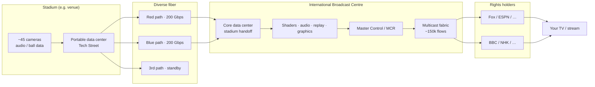
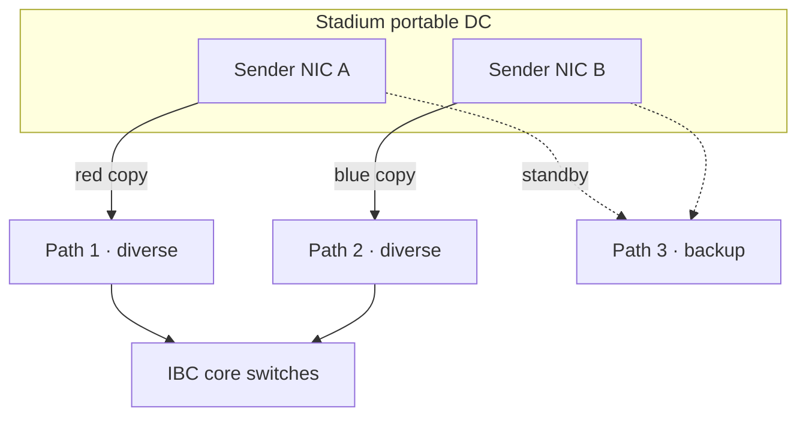
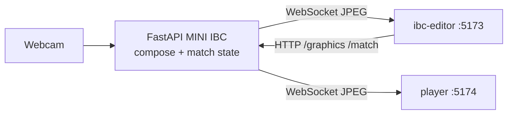

# How the FIFA World Cup IBC Works

A clear summary of how the **International Broadcast Centre (IBC)** turns a match at a stadium into what you watch on TV worldwide.

Inspired by Network Chuck’s deep dive with HBS (Host Broadcast Services). For the full story, tour footage, and packet-capture walkthrough, watch:

**[How the World Cup Network Works (Network Chuck)](https://www.youtube.com/watch?v=LhnH0juUaGw)**

---

## The big idea

> The game happens at the stadium.  
> **The World Cup broadcast is made at the IBC.**

Cameras, mics, and data leave ~16 stadiums over high-capacity fiber into one temporary media “factory.” There, shaders, audio, replays, and graphics shape a consistent world feed. Multicast then fans that feed out to rights-holding broadcasters (Fox, BBC, NHK, ESPN, …), who add commentary and local production for viewers in Singapore, Ethiopia, Japan, Brazil, and everywhere else.

**Failure is not an option** — so almost everything is duplicated, diverse-pathed, and rehearsed for years.

---

## End-to-end path (kick → living room)



**One sentence:** stadium sends (usually) one copy of each feed *into* the IBC network; the network **multicasts** it to every broadcaster that subscribed — without the stadium sending 100 separate streams.

---

## Why centralize at the IBC?

| At the stadium (1994-style) | At the IBC (modern) |
|-----------------------------|---------------------|
| Many on-site teams per venue | Fewer, elite teams in one place |
| Harder to keep look/feel identical | Same shaders, graphics, replay standards |
| Expensive to staff 16× full crews | Train/brief once; consistency across matches |

In 1994 in Dallas they already wanted this, but fiber capacity wasn’t enough to pull *everything* back. Today, **three × 200 Gbps** diverse links per stadium make full centralization possible.

IBC roles that “make” the match:

- **Shaders** — remote color, brightness, contrast  
- **Audio mix / QC** — 5.1 mix; anomaly listening  
- **Replay** — instant replay (very expensive server farms)  
- **Graphics** — scorebugs, titles, lower thirds  
- **MCR** — ingest hundreds of feeds both ways (venue ↔ IBC)  
- **Comms** — commentary delay so audio doesn’t call a goal before video  

The **director** usually stays at the venue (live shot calling) while talking to IBC.

---

## Stadium ↔ IBC connectivity

Every stadium roughly has:

1. A **portable data center** (often on “Tech Street”)  
2. **Three 200 Gbps** fiber paths on **diverse routes**  
3. Dual active transmission: **red** and **blue** packet copies  



**Why three links?** Fiber cuts happen (construction drilling, etc.). Design goal: always keep **at least two** live.

**Why red + blue?** Not idle backups. Both copies are sent and both are used. Receivers pick **whichever packet arrives first** (hitless). Red and blue should take **different switch paths** so one failure doesn’t kill both.

Demo addressing (illustrative only — not real tournament IPs):

| Role | Demo network | Notes |
|------|----------------|-------|
| Red video | `10.182.0.0/16` | Second octet marks “color” / plane |
| Blue video | `10.181.0.0/16` | Physically separate fabric |
| Video vs audio | `…x.20.*` vs `…x.30.*` | Convention in demos/docs |
| Multicast group (example) | `239.10.20.1` | Many receivers join one group |

---

## Multicast: one camera → many broadcasters

Without multicast, one camera wanted by 100 outlets ≈ 100 streams on the stadium uplink — link death.

With multicast:

```text
Camera A ──(1 stream)──► IBC fabric ──┬──► Broadcaster Fox
                                      ├──► Broadcaster NHK
                                      ├──► Broadcaster BBC
                                      └──► …
```

Scale discussed in the tour:

- On the order of **~150,000 multicast flows** managed at once  
- ~**45 cameras** per match (finals often more, e.g. ~50)  
- Plus audio, commentary, data  
- IBC sized for **multiple matches in parallel** (e.g. up to six)  
- Dual (red/blue) delivery multiplies fan-out again  

A normal enterprise multicast design isn’t enough. HBS uses custom control software (**TFC**) that:

- Sees the whole fabric via **gRPC** to **Cisco Nexus** (and some **Arista**) switches  
- Statically programs routes so red/blue take **disjoint paths**  
- Treats the second stream as **peer**, not hot standby  

At each receiver: identical red/blue RTP-style streams → **first packet wins** per sequence.

---

## Media over IP (ST 2110) — what a packet capture shows

World Cup contribution video is often **uncompressed** over IP (far heavier than YouTube MP4).

From the video’s capture walkthrough (orders of magnitude):

| Sample | Packets | Wall time | Rough rate |
|--------|---------|-----------|------------|
| Short | ~10,000 | ~27 ms | — |
| Longer | ~530,000 | ~1 s | ~5.2 Gbps |

Useful filters / ideas (Wireshark-style):

- **ST 2110-20** — uncompressed video essence  
- **RTP marker** — frame boundaries  
- Example geometry discussed: 1080p @ 59.94 fps → on the order of **thousands of packets per frame** (e.g. ~4320 in the demo math)  
- Same sequence/timestamp on red vs blue, **different destinations / networks**

That is how a kick in Boston can become pixels on a TV in Singapore: stadium → dual fiber → IBC production → multicast → rights holder → local broadcast.

---

## Audio and the smart ball

- Field mics around the pitch capture kick/impact sound.  
- The **connected ball** reports position/velocity; audio can **auto-ride** mics nearer the ball.  
- Older workflow: an operator tracked the ball manually on a tablet — same idea, more human.

Commentary audio often arrives **faster than video**, so IBC inserts delay so commentators don’t shout “GOAL!” before the picture.

---

## Fallback: failure is not an option

Stadiums still carry a **mini IBC**: shaders, replay, audio, graphics — usually idle.

If all fiber to the IBC dies:

1. Local crew starts making the match on site  
2. **Satellite truck** uplinks to IBC and/or directly to broadcasters  

The match must go out even if Dallas goes dark.

HBS also typically **runs its own fiber** inside the venue rather than relying on the stadium’s existing plant.

---

## Temporary by design

The IBC and its mission-critical network are **temporary**:

- Built in months (on the order of ~4 months in the tour narrative)  
- Torn down after the trophy lift (days to start pack-up; weeks to fully demobilize)  

Years of prep (including dress rehearsals / Club World Cup–scale tests), fake matches, and audio sync make match day feel calm — more “well-oiled machine” than NASA countdown.

---

## How this maps to **this repo** (MINI IBC)

This project is a **tiny teaching toy**, not a real HBS plant:

| Real World Cup IBC | MINI IBC |
|--------------------|----------|
| Stadium cameras | Webcam |
| Fiber + ST 2110 + dual path | Local compose + WebSocket JPEG frames |
| Multicast to many RHBs | Two React apps (editor + player) |
| Graphics / scorebug teams | Editor pushes titles + live score API |
| TFC + Nexus fabric | FastAPI `FrameHub` fan-out |



See the main [README](README.md) for how to run the PoC.

---

## Further watching

Full narrative, people, PCAP demos, and stadium tour:

**https://www.youtube.com/watch?v=LhnH0juUaGw**

Credit: Network Chuck × HBS engineering (Kristoff and team). This document is an educational rewrite for the **MINI IBC** lab — not an official FIFA/HBS specification.
